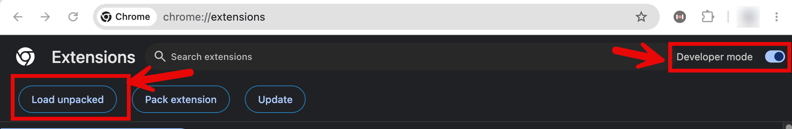
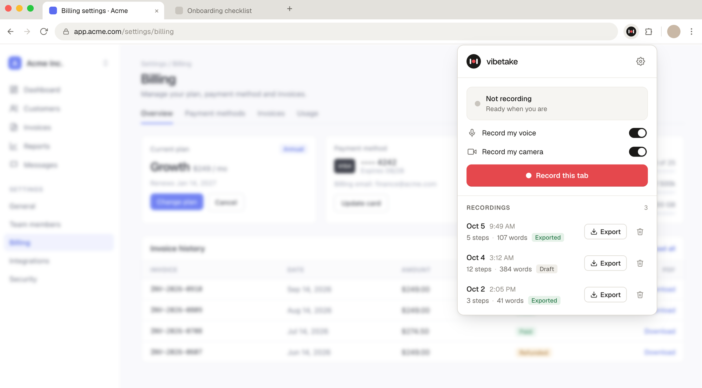

<p align="center"></p>

<p align="center"><a href="#quick-start">Quick start</a> &middot; <a href="#make-the-video">Make the video</a> &middot; <a href="GUIDE.md">Guide</a> &middot; <a href="#privacy">Privacy</a> &middot; <a href="CONTRIBUTING.md">Contributing</a></p>

**Polished demo videos of what you are building, made by the AI you already use.**

A screen recording is not enough for an AI to cut a good demo: it cannot see where you clicked,
when the page settled, or what you said at that moment. VibeTake is a Chrome extension that records
your demo **with that metadata**: every click with its control's name and rectangle, a pointer-free
still at each step, your voice and optionally your camera, and a word-timestamped transcript, all in
one zip. Hand the zip and a prompt to Claude Design, Claude Code or Codex, and you get the video.

If VibeTake saves you an afternoon of editing, please ⭐ **star the repo**. It is the main way
other people building things find it.

## Quick start

**1. Install** (Node 22 or newer, and Chrome)

```bash
git clone https://github.com/ghoshsanjoy78/vibetake.git
cd vibetake
npm install --omit=dev
```

**2. Load the extension in Chrome**

Open `chrome://extensions`, turn on **Developer mode**, click **Load unpacked**, and pick the
`extension/dist` folder.

<p align="center"></p>

**3. Add your transcription key and start the local service**

Copy `.env.example` to `.env.local`, fill in `OPENAI_API_KEY` or `OPENROUTER_API_KEY`, then:

```bash
npm run serve
```

Leave it running while you record. The extension connects to it by itself.

**4. Record**

<p align="center"></p>

Open your app, click the VibeTake icon in your Chrome extension bar, press **Record this tab**, do
your walkthrough while talking, press **Stop**, then **Export**. Turn on **Record my camera** first if you want your face in the
video. Chrome asks for the microphone and camera once.

You get one zip with everything in it. That is the whole recording side.

## Make the video

Pick a prompt from [`prompts/`](prompts/README.md): [faceless](prompts/demo-video-faceless.md)
(stills plus a synthesized voice) or [with your face](prompts/demo-video-with-face.md) (your webcam
clip and your own voice). Fill in the bracketed lines at its top. Then:

**With Claude Design** (no coding tool needed)

1. Unzip the recording.
2. Open [claude.ai/design](https://claude.ai/design) and choose the **Animate** template.
3. Paste the prompt and attach the unzipped folder.
4. Ask for changes by step number or time: "hold longer on step 4", "the outline is wrong at 0:41".

**With Claude Code or Codex**, using HyperFrames or Remotion: unzip, add the framework's skills in
that folder, start your agent there, paste the prompt and ask for a composition. The exact commands
for each are in the [guide](GUIDE.md#with-hyperframes).

## Privacy

Everything runs on your machine. The only thing that leaves it is the voice track, sent to the
transcription provider you chose. Your key stays in `.env.local` and never enters the browser.
Details in [`SECURITY.md`](SECURITY.md).

## Licence

[Apache License 2.0](LICENSE). Bundled Playwright and fflate code keeps its own licences; see
[`NOTICE`](NOTICE). Contributions are welcome: [`CONTRIBUTING.md`](CONTRIBUTING.md).
